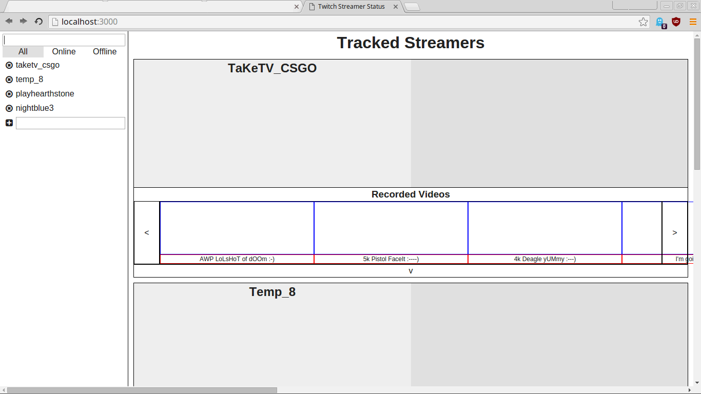

# Twitch Streamers - Angular Refactor

This is an incomplete but functional AngularJS refactor of the [Twitch Streamers project](https://github.com/Tempurturtul/fcc-twitch-streamers). In addition to using AngularJS, this refactor adds the ability to modify which streamers are listed and includes a greater range of information on each streamer.

## Quickstart

- Install [Node.js](https://nodejs.org/) and [Gulp](http://gulpjs.com/).
- Download the repository and checkout this branch.
```
  git clone https://github.com/Tempurturtul/fcc-twitch-streamers.git
  cd fcc-twitch-streamers/
  git checkout angular-refactor
```
- Install npm packages, then run the default gulp task to serve source files. *(See `gulpfile.js` for additional tasks.)*
```
  npm install
  gulp
```

## Mockup


## Current Preview

